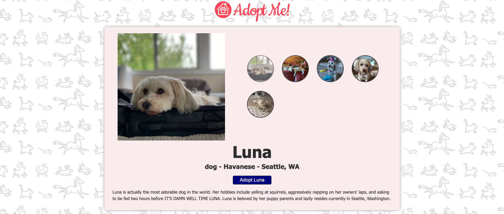

# adopt-me

A pet adoption web application.  
This project was done as part of the [Frontend Masters Course: Complete Intro to React](https://frontendmasters.com/courses/complete-react-v6/).  

## System dependencies

- Git
- NodeJS

## Project Setup

1. Make sure you are in the project directory.
2. Run `npm install` to install dependencies.
3. Run `npm run dev` to start a development server on [http://localhost:8080/](http://localhost:8080/)

## Project Feature

1. **Search for a pet**

- Via the form at the homepage
- Can filter based on location, animal and breed.
- Breed will update dynamically after animal is changed.

2. **Details of a pet**

- Show details of a pet including images, description, breed, etc.
